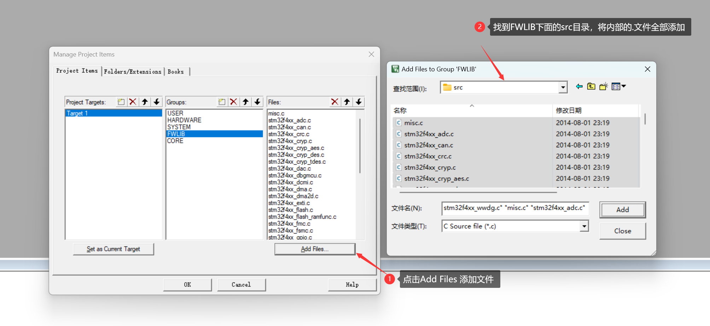
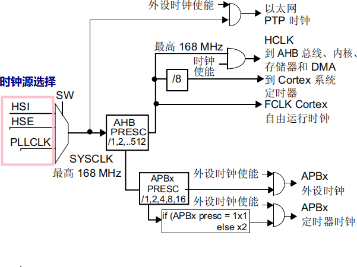

[TOC]

# 环境搭建专题

## 1、安装keil_MDK软件

### 1.1 软件安装

1.   双击打开`MDK514`软件安装包


2.   点击下一步进行安装


3.   点击同意，并进行下一步


4.   选择你的安装路径，建议：不要装在C盘，选择完成后，继续下一步安装

>   Coer ： 是软件存放位置
>
>   Pack ： 是芯片包存放位置


5.   keil要求你填写公司信息，这个可以随便填写


6.   等待安装完成

。。。。。。。


### 1.2 软件破解


当我们安装完成keil软件之后，我们需要对keil进行破解

1.   在资料包中找到资料破解包，并以<span style = 'color :red'><以管理员身份运行></span>     <span style = 'color :red'>[注：需要将电脑声音关闭]</span>

>   如果你打开资料包，发现没有这个KEIL的破解文件，那是因为你的杀毒软件是开启的，需要关闭杀毒软件，然后重新解压一次


2.   还需要使用<span style = 'color :red'>以管理员身份运行</span>重新打开KEIL_MDK软件 ，


3.   打开keil中的注册 ，从菜单栏中 点击<文件> ， 然后点击注册


4.   依据下图进行安装


然后你就完成了keil 注册


### 1.3 安装Jilnk

1.   解压Jilnk，并进行安装


>   后面就是根据软件提示一步一步进行安装


2.   程序下载测试


## 2、新建工程

### 2.1 新建工程文件夹

​	首先在建立工程之前，我们需要建立一个工程文件夹，方便保存我们的工程，以及方便我们后续找到这个工程。

​	比如我这里，建立了一个 `<STM32>`的文件夹，方便保存我们的工程文件，以及后面的文件寻址。


​	然后在工程文件夹中，建立一些文件夹，这些文件夹是用于我们分类存储STM32开发过程中所所产生的文件或者是系统文件以及设备文件


### 2.2 从keil中创建工程文件

​	点击project -> New Progect 


​	按照下图操作， 重点是需要找到你刚刚创建的那个目录


​	接下来我们就需要开始选择芯片，操作如下，我们蜘蛛侠开发板所使用的是 ->`STM32F407VET6`


​	做完这一步，基本工程就创建完成。


### 2.3 导入固件库

​	找到固件库


​	导入`FWLIB`的文件 设备库文件，从固件库中的`STM32F4xx_DSP_StdPeriph_Lib_V1.4.0` -> `Libraries` -> `STM32F4xx_StdPeriph_Driver` 下面找到 `inc`和`src`


​	将这两个文件复制到，我们工程目录下 `STM32 `-> `FWLIB`


​	导入`CORE`文件 启动文件 ， 从`\STM32F4xx_DSP_StdPeriph_Lib_V1.4.0\Libraries\CMSIS\Device\ST\STM32F4xx\Source\Templates\arm`找到 `startup_stm32f40_41xxx.s`文件 ，将这个文件拷贝到`CORE` 目录中


​	从`\STM32F4xx_DSP_StdPeriph_Lib_V1.4.0\Libraries\CMSIS\Include` 目录下找到 `core_cm4.h`、`core_cm4_simd.h`、`core_cmFunc.h`、`core_cmInstr.h` ，将这些文件复制到`CORE` 目录中


​	导入`USER`中的文件，`\STM32F4xx_DSP_StdPeriph_Lib_V1.4.0\Libraries\CMSIS\Device\ST\STM32F4xx\Include`  中找到`stm32f4xx.h ` 和 `system_stm32f4xx.h `放到`USER`


​	导入`USER`中的文件, 从`\STM32F4xx_DSP_StdPeriph_Lib_V1.4.0\Project\STM32F4xx_StdPeriph_Templates`中找到这几个`stm32f4xx_conf.h` ， `stm32f4xx_it.c `，` stm32f4xx_it.h ` ,`system_stm32f4xx.c` 复制到 `USER` 目录中去


### 2.4 在KEIL中添加固件库

​	文件复制完成之后，我们就需要来到软件中，进行对工程进行更改

​	首先第一步，我们需要配置工程文件夹，将图中的文件夹配置上去


​	然后我们需要添加FWLIB中的文件 是添加.C文件，也就是FWLIB中的src



​	删除`stm32f4xx_fmc.c`


​	添加启动文件，需要改变一下文件类型，不然看到不这个  .s  文件


​	

​	添加`USER`中的文件


### 2.5 配置头文件路径

​	在完成了前面的工程文件的导入后，我们需要添加他们的头文件，如果这一步不错，后续编译的时候会进行报错


​	点击选择文件夹， 导入inc目录


​	按照上面的方法，依次添加 `USER`、`CORE`、`FWLIB\inc`


​	在完成了上面的操作之后，我们需要输入一串宏定义 `STM32F40_41xxx,USE_STDPERIPH_DRIVER`


​	我们需要改变一些obj文件的路径


# GPIO专题

## 1、概述

GPIO,即通用I/O（输入输出） 端口，是STM32可控制的引脚。STM32芯片的 <span style ='color:orange' >GPIO引脚 </span>与 <span style = 'color:orange'>外部设备链接</span> 起来，可实现<span style = 'color:orange' >外部通讯</span>、<span style = 'color:orange'>控制外部硬件</span>或者采集外部硬件数据。

STM32F407有7组IO。分别为<span style = 'color:orange'>GPIOA~GPIOG</span>，每组IO有16个IO口，共有144个IO口（我们的STM32F407VET6有100个IO口）。通常称为 <span style = 'color:orange'>PAx、PBx、PCx、PDx、PEx、PFx、PGx</span>，其中x为0-15，并且F4系列是基于Cortex-M4内核。

GPIO的复用：

​	STM32F4 有很多的内置外设，这些外设的外部引脚都是与 GPIO 共用的。也就是说，一个引脚可以有很多作用，但是默认为IO口，如果想使用一个 GPIO内置外设的功能引脚，就需要GPIO的复用，那么当这个 GPIO 作为内置外设使用的时候，就叫做复用。比如说串口就是GPIO复用为串口。

-   [ ] 开关量的输入、输出，读取开关的状态，控制开关的关和开。 

- [ ] 控制硬件，例如LED，蜂鸣器 

-   [ ]  用于中断信号的输入引脚 

-   [ ] 使用GPIO模拟I2C, SPI接口时序与外部设备通信等。

## 2、GPIO库函数配置介绍

### 2.1 GPIO_Mode

-   **GPIO_Mode_OUT**<span style = 'color : orange'>（通用输出模式）</span>：将GPIO引脚配置为通用输出模式。这意味着该引脚可以通过软件控制来<span style = 'color : red'>输出高电平或低电平信号</span>，通常用于驱动外部设备，如LED、继电器等。在这种模式下，引脚可以用于输出数字信号。


-   **GPIO_Mode_IN**<span style = 'color : orange'>（通用输入模式）</span>：将GPIO引脚配置为通用输入模式。在这种模式下，<span style = 'color : red'>引脚用于读取外部信号</span>，例如开关状态、传感器输出等。通过这种模式，可以读取引脚上的数字信号状态。


-   **GPIO_Mode_AF**<span style = 'color : orange'>（引脚复用模式）</span>：将GPIO引脚配置为引脚复用模式。<span style = 'color:red'>这意味着引脚可以连接到某个特定的功能</span>，例如UART、SPI、I2C等，以允许多个不同的功能共享相同的引脚。在这种模式下，引脚扮演另一个外设的角色。


-   **GPIO_Mode_AN**<span style = 'color : orange'>（模拟输入模式）</span>：将GPIO引脚配置为模拟输入模式。在这种模式下，<span style = 'color:red'>引脚用于连接到模拟传感器</span>，以测量模拟电压。这个选项适用于需要模拟信号输入的应用。


-   **GPIO_Mode_AIN**<span style = 'color : orange'>（模拟输入模式，通常用于区分）</span>：与GPIO_Mode_AN类似，<span style = 'color:red'>将GPIO引脚配置为模拟输入模式</span>。这个选项通常用于区分与普通数字输入模式的区别，以便在文档中更明确地表示引脚的用途。

### 2.2 GPIO_OType

-   **GPIO_OType_PP**<span style = 'color : orange'>（推挽输出模式）</span>：在这种模式下，GPIO引脚配置为推挽输出。<span style = 'color:red'>这意味着引脚可以输出高电平和低电平信号。</span>当引脚被配置为推挽输出时，<span style = 'color:red'>它可以提供有效的驱动能力，</span>即能够输出相对较高的电流，通常用于连接到外部数字电路或需要提供稳定的电压的设备。
-   **GPIO_OType_OD**<span style = 'color : orange'>（开漏输出模式）</span>：在这种模式下，GPIO引脚配置为开漏输出。在开漏输出模式下，<span style = 'color : red'>引脚只能拉低，而不能主动拉高。</span>当引脚需要输出高电平时，它处于<span style = 'color : red'>高阻态</span>状态，需要外部上拉电阻来维持高电平。这种模式通常用于连接到开漏输出的外部设备，例如I2C总线，其中多个设备可以共享同一个总线并拉低总线来产生逻辑低电平。

### 2.3 GPIO_PuPd

-   **GPIO_PuPd_NOPULL**<span style = 'color : orange'>（无上拉/下拉电阻）</span>：在这种模式下，<span style = 'color : red'>GPIO引脚没有启用上拉或下拉电阻</span>。引脚会浮动，即在没有外部连接时处于未定义状态。这种模式适用于需要外部电路明确地定义引脚状态的情况。
-   **GPIO_PuPd_UP**<span style = 'color : orange'>（上拉电阻）</span>：启用上拉电阻后，引脚在未连接时会拉高到逻辑高电平。这可以帮助防止输入信号漂移，确保引脚在未连接时具有明确定义的状态，通常用于输入引脚，以防止漂移。
-   **GPIO_PuPd_DOWN**<span style = 'color : orange'>（下拉电阻）</span>：启用下拉电阻后，引脚在未连接时会拉低到逻辑低电平。与上拉电阻相反，这也有助于防止输入信号漂移。通常也用于输入引脚，具体使用取决于应用需求。

### 2.4 MOS管 工作原理

MOS管，全名金属氧化物半导体场效应晶体管（Metal-Oxide-Semiconductor Field-Effect Transistor），是一种重要的半导体器件，用于放大和开关电信号。MOS管是现代电子设备中广泛使用的关键组件，包括微处理器、存储器、放大器、模拟电路等。

MOS管的主要特点和工作原理包括：

1.  结构：MOS管包括一个金属门极、一个氧化物绝缘层和半导体材料（通常是硅）组成。这三个组成部分构成了MOS管的基本结构。金属门极与绝缘层之间的电场控制半导体中的电子流，因此称为场效应晶体管。
2.  工作原理：MOS管的工作原理基于电场效应，通过在金属门极上施加电压，可以控制绝缘层下面的半导体中的电子流。当金属门极上的电压变化时，电场强度改变，从而调整半导体中的电荷分布。这影响了半导体中的电子流，从而实现了放大或开关功能。
3.  类型：MOS管有两种主要类型：N沟道MOS（NMOS）和P沟道MOS（PMOS）。NMOS管是N型半导体材料制成的，PMOS管是P型半导体材料制成的。它们在工作原理上略有不同，但都是基于电场效应来控制电子流。
4.  CMOS技术：CMOS（Complementary Metal-Oxide-Semiconductor）是一种广泛使用的MOS技术，结合了NMOS和PMOS管。CMOS技术允许低功耗、高性能的数字电路设计，因此在集成电路中得到广泛应用，如微处理器、存储器和数字逻辑电路。

MOS管的发展和改进在现代电子领域发挥了巨大作用，它们具有高集成度、低功耗和快速开关速度等优点，因此被广泛用于各种应用，从移动设备到计算机系统，甚至通信设备和模拟电路。


<video src="./video/Mos管的工作原理.mp4"></video>


### 2.5 推挽&开漏电路原理

推挽和开漏电路是两种常见的数字电路配置，用于控制外部负载（如电机、继电器、LED等），它们有不同的工作原理和应用。

#### 1. 推挽电路（Push-Pull Circuit）原理：

推挽电路是一种数字输出电路，通常用于驱动要求双向控制的负载，如电机或音响扬声器。它由两个互补的输出晶体管组成，一个是NPN型，另一个是PNP型。这两个晶体管连接在一起，共同控制负载的电流流动。

工作原理：

-   当输入信号为低电平时，NPN型晶体管导通，允许电流从电源流向负载，使负载处于高电平状态。
-   当输入信号为高电平时，PNP型晶体管导通，允许电流从负载流向地，使负载处于低电平状态。
-   通过交替控制两个晶体管的导通状态，推挽电路可以在输出端产生正反两种电平，实现双向控制。

应用：

-   推挽电路常用于驱动电机、扬声器和其他需要双向控制的负载，因为它可以提供较高的输出电流和功率。


#### 2. 开漏电路（Open-Drain Circuit）原理：

开漏电路是一种数字输出电路，通常用于实现单向控制的负载，如I2C总线和GPIO引脚上的信号线。它通常由一个NPN型晶体管或MOSFET管组成，这个晶体管将输出信号拉向地，但不提供高电平输出。

工作原理：

-   当输入信号为高电平时，开漏输出处于高阻态，不提供电流流向负载，从而使负载处于高电平状态。
-   当输入信号为低电平时，开漏输出处于低电平，将电流引导到地，使负载处于低电平状态。

应用：

-   开漏电路常用于需要多路设备共享同一信号线的场合，例如I2C通信总线。多个设备可以共用一个开漏输出，通过外部上拉电阻实现高电平。
-   开漏输出也可用于与其他开漏输出连接的逻辑门或其他数字电路中，以实现复杂的逻辑功能。

总之，推挽电路用于双向控制负载，而开漏电路用于单向控制负载，根据应用需求选择适当的电路配置。

<video controls src="./video/开漏输出_推挽输出.mp4"></video>

### 2.6 上拉&下拉电路原理

上拉电路（Pull-Up Circuit）和下拉电路（Pull-Down Circuit）是常见的电子电路配置，用于确定数字信号的电平，特别是在数字输入/输出（I/O）端口中。它们通过连接电阻到电源电压或地来实现信号电平的稳定控制。

#### 1. 上拉电路（Pull-Up Circuit）原理：

上拉电路通常用于将一个信号线拉向高电平。这种电路将一个电阻连接到信号线和电源电压之间。典型的上拉电路使用一个上拉电阻连接到信号线和电源电压（通常是VCC）之间。当没有外部驱动力时，上拉电阻会将信号线拉向高电平。

工作原理：

-   当外部设备在信号线上施加低电平时，外部电路的电流会流经上拉电阻，使信号线维持在低电平。
-   当外部设备不施加电压时，上拉电阻将信号线拉向高电平（电源电压）。

应用：

-   上拉电路常用于数字输入端口，确保在没有外部输入时信号线处于高电平状态。这有助于减少输入端口的漂移或不稳定性。


#### 2. 下拉电路（Pull-Down Circuit）原理：

下拉电路通常用于将一个信号线拉向低电平。这种电路将一个电阻连接到信号线和地之间。典型的下拉电路使用一个下拉电阻连接到信号线和地之间。当没有外部驱动力时，下拉电阻会将信号线拉向低电平。

工作原理：

-   当外部设备在信号线上施加高电平时，外部电路的电流会流经下拉电阻，使信号线维持在高电平。
-   当外部设备不施加电压时，下拉电阻将信号线拉向低电平（地）。

应用：

-   下拉电路通常用于数字输入端口，确保在没有外部输入时信号线处于低电平状态。这有助于减少输入端口的漂移或不稳定性。

总之，上拉和下拉电路是用于确保数字信号电平的稳定性和可靠性的常见技术。它们在数字电子设备和微控制器应用中非常常见，用于控制输入和输出信号的电平状态。

<video src="./video/上拉电阻的通俗解释.mp4"></video>

下拉电阻

<video src="./video/下拉电阻的通俗解释.mp4"></video>


## 3、库函数点灯


### 3.1 原理图分析


>   在本次使用到的开发板中共有3个LED
>
>    -> LED1 --- PE8
>
>    -> LED2 --- PE9
>
>    -> LED3 --- PE10

### 3.2 实物图找丝印

### 3.3 映射地址空间

>   查询芯片手册 <span style = 'color : orange'>STM32F4xx中文参考手册.pdf</span> 找到内存地址


### 3.4 库函数开发

>   stm32f4xx_gpio.h 文件 内置函数说明


>void GPIO_SetBits(GPIO_TypeDef* GPIOx, uint16_t GPIO_Pin);       // 将引脚置为高电平
>void GPIO_ResetBits(GPIO_TypeDef* GPIOx, uint16_t GPIO_Pin);    // 将引脚置为低电平
>void GPIO_WriteBit(GPIO_TypeDef* GPIOx, uint16_t GPIO_Pin, BitAction BitVal);  //对一个写入电平
>void GPIO_Write(GPIO_TypeDef* GPIOx, uint16_t PortVal);       // 对一组写入电平
>void GPIO_ToggleBits(GPIO_TypeDef* GPIOx, uint16_t GPIO_Pin); // 反转


#### 1. 端口硬件使能

```c

/**
  * @brief  使能或去使能AHB1外设时钟。 .
  * @note   复位后，外设时钟(用于寄存器读/写访问) 被禁用，并且应用软件之前必须启用此时钟使用它  
  * @param  RCC_AHBPeriph:
  *         指定AHB1外设对其时钟进行门控。该参数可以是以下值的任意组合:
  *            @arg RCC_AHB1Periph_GPIOA:       GPIOA clock
  *            @arg RCC_AHB1Periph_GPIOB:       GPIOB clock 
  *            @arg RCC_AHB1Periph_GPIOC:       GPIOC clock
  *            @arg RCC_AHB1Periph_GPIOD:       GPIOD clock
  *            @arg RCC_AHB1Periph_GPIOE:       GPIOE clock
  *            @arg RCC_AHB1Periph_GPIOF:       GPIOF clock
  *            @arg RCC_AHB1Periph_GPIOG:       GPIOG clock
  *            @arg RCC_AHB1Periph_GPIOG:       GPIOG clock
  *            @arg RCC_AHB1Periph_GPIOI:       GPIOI clock
  *            @arg RCC_AHB1Periph_GPIOJ:       GPIOJ clock (STM32F42xxx/43xxx devices) 
  *            @arg RCC_AHB1Periph_GPIOK:       GPIOK clock (STM32F42xxx/43xxx devices)  
  *            @arg RCC_AHB1Periph_CRC:         CRC clock
  *            @arg RCC_AHB1Periph_BKPSRAM:     BKPSRAM interface clock
  *            @arg RCC_AHB1Periph_CCMDATARAMEN CCM data RAM interface clock
  *            @arg RCC_AHB1Periph_DMA1:        DMA1 clock
  *            @arg RCC_AHB1Periph_DMA2:        DMA2 clock
  *            @arg RCC_AHB1Periph_DMA2D:       DMA2D clock (STM32F429xx/439xx devices)  
  *            @arg RCC_AHB1Periph_ETH_MAC:     Ethernet MAC clock
  *            @arg RCC_AHB1Periph_ETH_MAC_Tx:  Ethernet Transmission clock
  *            @arg RCC_AHB1Periph_ETH_MAC_Rx:  Ethernet Reception clock
  *            @arg RCC_AHB1Periph_ETH_MAC_PTP: Ethernet PTP clock
  *            @arg RCC_AHB1Periph_OTG_HS:      USB OTG HS clock
  *            @arg RCC_AHB1Periph_OTG_HS_ULPI: USB OTG HS ULPI clock
  * @param  NewState:指定外设时钟的新状态。取值为:ENABLE 或 DISABLE。
  * @retval 无
  */
void RCC_AHB1PeriphClockCmd(uint32_t RCC_AHB1Periph, FunctionalState NewState)
```

#### 2.GPIO初始化 结构体

```c
/** 
  * @brief   GPIO初始化结构定义  
  */ 
typedef struct
{
  uint32_t GPIO_Pin;              /*!< 指定要配置的GPIO引脚。该参数可以是@ref GPIO_pins_define的任意值 */
  GPIOMode_TypeDef GPIO_Mode;     /*!< 指定所选引脚的工作模式。该参数可以是@ref GPIOMode_TypeDef的值 */
  GPIOSpeed_TypeDef GPIO_Speed;   /*!< 指定所选引脚的速度。该参数可以是@ref GPIOSpeed_TypeDef的值 */
  GPIOOType_TypeDef GPIO_OType;   /*!< 指定所选引脚的工作输出类型。该参数可以是@ref GPIOOType_TypeDef的值 */
  GPIOPuPd_TypeDef GPIO_PuPd;     /*!< 指定所选引脚的上拉/下拉操作。该参数可以是@ref GPIOPuPd_TypeDef的值 */
}GPIO_InitTypeDef;
```

``

#### 3. GPIO的初始化

```c
/**
  * @brief  根据GPIO_InitStruct中的指定参数初始化GPIOx外设。
  * @param  GPIOx:其中x可以为(A..K)选择STM32F405xx/407xx和STM32F415xx/417xx设备的GPIO外设
  *               x可以(A..I)选择STM32F42xxx/43xxx设备的GPIO外设。
  *               x可选(A、B、C、D、H)选择STM32F401xx的GPIO外设
  * @param  GPIO_InitStruct:指向GPIO_InitTypeDef结构体的指针，该结构体包含指定GPIO外设的配置信息。
  * @retval 无
  */
void GPIO_Init(GPIO_TypeDef* GPIOx, GPIO_InitTypeDef* GPIO_InitStruct)
```

#### 4. 设置初始电平

-   设置高电平

```c
/**
  * @brief  设置所选数据端口位。
  * @note   这个函数使用GPIOx_BSRR寄存器来允许原子读/修改访问。这样，在读取和修改访问之间就没有发生IRQ的风险。
  * @param  GPIOx:其中x可以为(A..K)选择STM32F405xx/407xx和STM32F415xx/417xx设备的GPIO外设
  *               x可以(A..I)选择STM32F42xxx/43xxx设备的GPIO外设。
  *               x可以(A、B、C、D、H)选择STM32F401xx器件的GPIO外设。
  * @param  GPIO_Pin:需要写的端口位。该参数可以是GPIO_Pin_x的任意组合，其中x可以是(0..15)。
  * @retval 无
  */
void GPIO_SetBits(GPIO_TypeDef* GPIOx, uint16_t GPIO_Pin)
```

-   设置低电平

```
**
  * @brief  清除所选数据端口位。
  * @note   这个函数使用GPIOx_BSRR寄存器来允许原子读/修改访问。这样，在读取和修改访问之间就没有发生IRQ的风险。
  * @param  GPIOx:其中x可以为(A..K)选择STM32F405xx/407xx和STM32F415xx/417xx设备的GPIO外设
  *               x可以(A..I)选择STM32F42xxx/43xxx设备的GPIO外设。
  *               x可以(A、B、C、D、H)选择STM32F401xx器件的GPIO外设。
  * @param  GPIO_Pin:需要写的端口位。该参数可以是GPIO_Pin_x的任意组合，其中x可以是(0..15)。
  * @retval 无
  */
void GPIO_ResetBits(GPIO_TypeDef* GPIOx, uint16_t GPIO_Pin)
```

设置引脚电平，可以尝试GPIO_Write、GPIO_WriteBit函数。

-   读取某个端口引脚电平

```c
/**
  * @brief  读取指定的输入端口引脚。
  * @param  GPIOx:其中x可以为(A..K)选择STM32F405xx/407xx和STM32F415xx/417xx设备的GPIO外设
  *               x可以(I)选择STM32F42xxx / 43xxx设备的GPIO外设。
  *               x可选(A、B、C、D、H)选择STM32F401xx的GPIO外设
  * @param  GPIO_Pin:要读取的端口位。该参数可以是GPIO_Pin_x，其中x可以是(0..15)。
  * @retval 输入端口引脚值。
  */
uint8_t GPIO_ReadInputDataBit(GPIO_TypeDef* GPIOx, uint16_t GPIO_Pin)
```

### 3.5 代码实现

#### 1. 实现流程


#### 2. 代码实现

```c
#include "stm32f4xx.h"

void LED_Init(void)
{
    // 使能GPIOE时钟
    RCC_AHB1PeriphClockCmd(RCC_AHB1Periph_GPIOE, ENABLE);

    GPIO_InitTypeDef GPIO_InitStruct;
    // 配置LED引脚为推挽输出模式
    GPIO_InitStruct.GPIO_Pin = GPIO_Pin_8 | GPIO_Pin_9 | GPIO_Pin_10;   //引脚
    GPIO_InitStruct.GPIO_Mode = GPIO_Mode_OUT;                          //模式
    GPIO_InitStruct.GPIO_OType = GPIO_OType_PP;                         //输出类型
    GPIO_InitStruct.GPIO_Speed = GPIO_Speed_50MHz;                      //输出速度
    GPIO_InitStruct.GPIO_PuPd = GPIO_PuPd_NOPULL;                       //上下拉状态
    GPIO_Init(GPIOE, &GPIO_InitStruct);

    // 默认关闭LED
    GPIO_SetBits(GPIOE, GPIO_Pin_8 | GPIO_Pin_9 | GPIO_Pin_10);         //置1操作函数
}
void delay_ms(uint32_t ms)
{
    // 基于系统时钟的粗略延时函数
    for (uint32_t i = 0; i < (ms * 10000); ++i) {
        __NOP();
    }
}

int main(void)
{
    LED_Init();

    while (1) {
        GPIO_SetBits(GPIOE, GPIO_Pin_8 | GPIO_Pin_9 | GPIO_Pin_10);     //全灭
        delay_ms(500);
        
        GPIO_ResetBits(GPIOE, GPIO_Pin_8);      //亮LED1
        delay_ms(500);
        
        GPIO_ResetBits(GPIOE, GPIO_Pin_9);      //亮LED2
        delay_ms(500);
        
        GPIO_ResetBits(GPIOE, GPIO_Pin_10);     //亮LED3
        delay_ms(500);
    }
}
```

## 4、库函数蜂鸣器

### 4.1 原理图分析


### 4.2 实物图找丝印

### 4.3 认识蜂鸣器


| 特性         | 有源蜂鸣器                                         | 无源蜂鸣器                                       |
| ------------ | -------------------------------------------------- | ------------------------------------------------ |
| 控制方式     | 需要外部电路驱动（通常需要使用外部信号源或IC控制） | 只需提供电源，无需外部控制电路                   |
| 内部振荡器   | 有内置振荡器，产生频率固定的声音                   | 无内置振荡器，需要外部信号来生成声音             |
| 发声频率控制 | 通常难以控制发声频率，通常是固定的                 | 可以通过改变驱动信号的频率来控制发声频率         |
| 驱动电路     | 驱动电路较为简单，通常只需要连接电源和控制引脚     | 驱动电路较为复杂，通常需要外部驱动电路来产生声音 |
| 发声方式     | 通常是方波声音，音调和音量不易调整                 | 通常可以产生多种音调和音量，较易调整             |
| 成本         | 通常较便宜                                         | 通常较昂贵                                       |
| 应用领域     | 适用于一些简单的报警、提示音和提醒应用             | 适用于音乐、语音合成、声效等更复杂的应用         |

<span style = 'color : red'>**有源蜂鸣器 :** </span>需要外部电路来生成声音，通常用于一些简单的警报和提示音效果。 

<span style = 'color : red'>**无源蜂鸣器 :** </span>则不需要外部控制电路，可以更灵活地产生不同音调和音量的声音，适用于更广泛的应用领域，包括音乐、语音合成和声效等。 

### 4.4 三极管工作原理


三极管（也称为晶体三极管或晶体管）是一种半导体器件，广泛用于电子电路中，用于放大电信号、开关电路、和信号调制等应用。它的工作原理基于半导体物理学和电子器件的行为。

三极管通常有三个引脚，分别为基极（Base）、发射极（Emitter）、和集电极（Collector）。三极管可以是NPN型或PNP型，下面分别介绍它们的工作原理： 基极（Base）:通过控制基极电流和电压，可以控制三极管的放大和开关行为，使得三极管在各种电子电路中有广泛的应用。 发射极（Emitter）:负责发射电子或	电子空穴，控制基极电流，确定三极管的极性，并在放大和开关电路中发挥重要作用。 集电极（Collector）：负责收集电荷载流子并提供电流负载，同时稳定三极管的工作状态，以确保它在不同应用中以可靠的方式工作。

#### **1. NPN型三极管：**

1.  基本构造：NPN型三极管由两个N型半导体材料夹着一个P型半导体材料组成，其中N代表负性，P代表正性。
2.  工作原理：
    -   当在基极（B）施加正电压时，它注入了少量的电子进入P型的基区。
    -   这些注入的电子在基区中移动，并通过与P型材料接触的发射极（E）流向外部电路。
    -   集电极（C）与发射极相连接，电子流从发射极流向集电极，形成电流放大作用。
    -   当基极电压足够大时，它会控制发射极到集电极之间的电流，从而实现放大和控制电流的作用。

 

#### **2. PNP型三极管：**

1.  基本构造：PNP型三极管由两个P型半导体材料夹着一个N型半导体材料组成，其中P代表正性，N代表负性。
2.  工作原理：
    -   当在基极（B）施加负电压时，它注入了少量的空穴（正电荷载流子）进入N型的基区。
    -   这些注入的空穴在基区中移动，并通过与N型材料接触的发射极（E）流向外部电路。
    -   集电极（C）与发射极相连接，空穴流从发射极流向集电极，形成电流放大作用。
    -   当基极电压足够小（接近零电压）时，它会控制发射极到集电极之间的电流，从而实现放大和控制电流的作用。

三极管的放大作用和电流控制是通过基极电流（输入电流）来实现的，当基极电流变化时，它可以显著地影响从发射极到集电极的电流（输出电流）。这使得三极管可以用作放大器、开关、和信号调制等各种电子电路中的重要元件。


### 4.5 代码实现

```c

#include "stm32f4xx.h"

void BEEP_Init(void)
{
    // 使能GPIOB时钟   RCC _ AHB1 Periph Clock Cmd   // 驼峰命名法
    RCC_AHB1PeriphClockCmd(RCC_AHB1Periph_GPIOB, ENABLE);

    GPIO_InitTypeDef GPIO_InitStruct;
    // 配置BEEP引脚为推挽输出模式
    GPIO_InitStruct.GPIO_Pin = GPIO_Pin_10;
    GPIO_InitStruct.GPIO_Mode = GPIO_Mode_OUT;
    GPIO_InitStruct.GPIO_OType = GPIO_OType_PP;
    GPIO_InitStruct.GPIO_Speed = GPIO_Speed_50MHz;
    GPIO_InitStruct.GPIO_PuPd = GPIO_PuPd_NOPULL;
    GPIO_Init(GPIOB, &GPIO_InitStruct);

    // 默认关闭BEEP
    GPIO_ResetBits(GPIOB, GPIO_Pin_10);
}

void delay_ms(uint32_t ms)
{
    // 基于系统时钟的粗略延时函数
    for (uint32_t i = 0; i < (ms * 10000); ++i) {
        __NOP();    //空操作
    }
}

int main(void)
{
    BEEP_Init();    //调用BEEP蜂鸣器初始化函数

    while (1) {
        GPIO_SetBits(GPIOB, GPIO_Pin_10);       //设置高电平,让蜂鸣器响
        delay_ms(500);
        
        GPIO_ResetBits(GPIOB, GPIO_Pin_10);     //设置低电平,让蜂鸣器不响
        delay_ms(500);
    }
}
```


### 4.6 关于GPIO配置详解

资料 ：  <span style = 'color: red'> STM32F4xx中文参考手册.pdf</span>


为什么要查询手册 -> 因为第一步我们要使能时钟


#### 1、 使能时钟 

```c
使能GPIO  组
#define RCC_AHB1Periph_GPIOA             ((uint32_t)0x00000001)
#define RCC_AHB1Periph_GPIOB             ((uint32_t)0x00000002)
#define RCC_AHB1Periph_GPIOC             ((uint32_t)0x00000004)
#define RCC_AHB1Periph_GPIOD             ((uint32_t)0x00000008)
#define RCC_AHB1Periph_GPIOE             ((uint32_t)0x00000010)
```

```c
RCC_AHB1PeriphClockCmd(RCC_AHB1Periph_GPIOE,ENABLE);
//    RCC _ AHB1 Periph Clock Cmd
//   在RCC中 总线	外设	  时钟  命令
// RCC_AHB1PeriphClockCmd - > 这个函数是关于  RCC -> AHB1总线 外设时钟启动命令
// RCC_AHB1Periph_GPIOE  ->  选择启用改时钟总线下的 那个外设 -> GPIOE
// ENABLE     ->    使能该外设时钟
```


#### 2、配置结构体

 ==外设== ==GPIO==

```c
结构体名称 -> GPIO_InitTypeDef
结构体的内容
typedef struct
{
  uint32_t GPIO_Pin;    			// 用于选择在那个引脚
  GPIOMode_TypeDef GPIO_Mode;       // 选择引脚 模式
  GPIOSpeed_TypeDef GPIO_Speed;  	// 选择引脚 速度
  GPIOOType_TypeDef GPIO_OType;     // 选择引脚 输出模式
  GPIOPuPd_TypeDef GPIO_PuPd;       // 选择引脚 上/下拉电阻
}GPIO_InitTypeDef;
```

```c
选择引脚 模式 -> GPIO_Mode
  GPIO_Mode_IN   = 0x00,    输入模式
  GPIO_Mode_OUT  = 0x01,    输出模式
  GPIO_Mode_AF   = 0x02,    复用模式 -> 当你要启动改引脚其他功能的时候，需要选择复用模式 如：USART、IIC、SPI
  GPIO_Mode_AN   = 0x03     模拟模式 -> 当你要启用 ADC DAC 的时候选择改模式
```

```c
选择引脚 输出模式 -> GPIO_OType
  GPIO_OType_PP = 0x00  	输出推挽模式  当你需要让引脚具备一定驱动能力的时候 -> 推挽模式
  GPIO_OType_OD = 0x01      输出开漏模式
```

```c
选择引脚 上/下拉电阻 GPIO_PuPd
  GPIO_PuPd_NOPULL = 0x00   无上/下拉
  GPIO_PuPd_UP     = 0x01   上拉电阻
  GPIO_PuPd_DOWN   = 0x02   下拉电阻
```

```c
GPIO_Init
函数原型:void GPIO_Init(GPIO_TypeDef* GPIOx, GPIO_InitTypeDef* GPIO_InitStruct)
函数功能:将 GPIO_InitTypeDef 结构体 配置到相应的 GPIOx 中
函数参数:
			GPIO_TypeDef* GPIOx     			选择GPIO组名
			GPIO_InitTypeDef* GPIO_InitStruct	传入结构体的配置
函数返回值:无
```

#### 3、配置初始电平

关于GPIO操作的函数

```c
void GPIO_SetBits(GPIO_TypeDef* GPIOx, uint16_t GPIO_Pin);
void GPIO_ResetBits(GPIO_TypeDef* GPIOx, uint16_t GPIO_Pin);
void GPIO_ToggleBits(GPIO_TypeDef* GPIOx, uint16_t GPIO_Pin);

void GPIO_WriteBit(GPIO_TypeDef* GPIOx, uint16_t GPIO_Pin, BitAction BitVal);
void GPIO_Write(GPIO_TypeDef* GPIOx, uint16_t PortVal);
```


```c
GPIO_SetBits -> 输出高电平
  GPIO _    Set       Bits
<所属功能>  <高电平> <位:操作对象>
函数原型:void GPIO_SetBits(GPIO_TypeDef* GPIOx, uint16_t GPIO_Pin);
函数功能:将确定的引脚 给 高电平
函数参数:
			GPIO_TypeDef* GPIOx     			选择GPIO组名
			uint16_t GPIO_Pin					选择引脚 号 
函数返回值:无
```

```c
GPIO_ResetBits -> 输出低电平
  GPIO _    Reset     Bits
<所属功能>  <低电平> <位:操作对象>
函数原型:void GPIO_ResetBits(GPIO_TypeDef* GPIOx, uint16_t GPIO_Pin);
函数功能:将确定的引脚 给 低电平
函数参数:
			GPIO_TypeDef* GPIOx     			选择GPIO组名
			uint16_t GPIO_Pin					选择引脚 号 
函数返回值:无
```

```c
GPIO_ToggleBits -> 输出翻转
  GPIO _    Toggle     Bits
<所属功能>  <翻转电平> <位:操作对象>
函数原型:void GPIO_ToggleBits(GPIO_TypeDef* GPIOx, uint16_t GPIO_Pin);
函数功能:将确定的引脚 给 低电平
函数参数:
			GPIO_TypeDef* GPIOx     			选择GPIO组名
			uint16_t GPIO_Pin					选择引脚 号 
函数返回值:无
```

```c
自己去尝试

void GPIO_WriteBit(GPIO_TypeDef* GPIOx, uint16_t GPIO_Pin, BitAction BitVal);

void GPIO_Write(GPIO_TypeDef* GPIOx, uint16_t PortVal);
```

#### 4、输入函数

```c
uint8_t GPIO_ReadInputDataBit(GPIO_TypeDef* GPIOx, uint16_t GPIO_Pin);   // 读取单个GPIO输入状态
uint16_t GPIO_ReadInputData(GPIO_TypeDef* GPIOx); 			// 读取整组输入状态
uint8_t GPIO_ReadOutputDataBit(GPIO_TypeDef* GPIOx, uint16_t GPIO_Pin);  // 单个GPIO输出状态
uint16_t GPIO_ReadOutputData(GPIO_TypeDef* GPIOx);          // 整组输出状态
```

```c
GPIO_ReadInputDataBit -> 输入读取
  GPIO _    Read Input  Data    Bit
<所属功能>  <读取> <输入> <数据> <位:操作对象>
函数原型:uint8_t GPIO_ReadInputDataBit(GPIO_TypeDef* GPIOx, uint16_t GPIO_Pin);
函数功能:读取 确定引脚的 电平
函数参数:
			GPIO_TypeDef* GPIOx     			选择GPIO组名
			uint16_t GPIO_Pin					选择引脚 号 
函数返回值:uint8_t   返回引脚的 电平
```


## 5、库函数按键

### 5.1 原理图分析


### 5.2 实物图找丝印


### 5.3 认识按键


​	按键需要消抖是因为机械按键的物理特性导致在按下或释放时会产生一系列的抖动信号。这种抖动信号会在短时间内多次切换按键状态，可能会被错误地识别为多次按下或释放操作，导致不可预期的结果。

主要原因如下： 1.机械性质：机械按键在按下和释放的瞬间，接触点会因为弹性或者机械震动而产生多次接触和断开，导致电信号出现快速变化。这种抖动现象是机械按键固有的特性。 2.电气特性：除了机械抖动，电气特性也可能引起按键信号的抖动。例如，按键的导线或连接器存在不良接触、电磁干扰等问题，也可能导致抖动信号。


### 5.4 代码实现

 ```c
 #include "stm32f4xx.h"
 void delay_ms(uint32_t ms)
 {
     // 基于系统时钟的粗略延时函数
     for (uint32_t i = 0; i < (ms * 10000); ++i) {
         __NOP();
     }
 }
 // 按键初始化函数
 void KEY_Init(void)
 {
     GPIO_InitTypeDef GPIO_InitStruct;
 
     // 使能按键 GPIO 时钟
     RCC_AHB1PeriphClockCmd(RCC_AHB1Periph_GPIOE | RCC_AHB1Periph_GPIOC, ENABLE);
 
     // 配置按键引脚为输入模式
     GPIO_InitStruct.GPIO_Pin = GPIO_Pin_4 | GPIO_Pin_5 | GPIO_Pin_6;
     GPIO_InitStruct.GPIO_Mode = GPIO_Mode_IN;   //输入模式
     GPIO_InitStruct.GPIO_PuPd = GPIO_PuPd_UP;   //上拉
     GPIO_Init(GPIOE, &GPIO_InitStruct);
 
     GPIO_InitStruct.GPIO_Pin = GPIO_Pin_13;
     GPIO_InitStruct.GPIO_Mode = GPIO_Mode_IN;   //输入模式
     GPIO_InitStruct.GPIO_PuPd = GPIO_PuPd_UP;   //上拉
     GPIO_Init(GPIOC, &GPIO_InitStruct);
 }
 
 uint8_t KEY_Scan(void)
 {
     // 检测KEY1是否按下
     //   	||	逻辑或   	两个数据进行比较
     //				10 || 10  == 1
     //				12 || 0   == 1
     //				0  || 0   == 0
     //		|	位或		对两组数据中的每个一位进行操作
     //			15 = 0000 1111
     //			16 = 0001 0000
     //			     0001 1111
     if(!GPIO_ReadInputDataBit(GPIOE, GPIO_Pin_4) || !GPIO_ReadInputDataBit(GPIOE, GPIO_Pin_5) || !GPIO_ReadInputDataBit(GPIOE, GPIO_Pin_6) || !GPIO_ReadInputDataBit(GPIOC, GPIO_Pin_13))
     {
         delay_ms(10);   //消抖
         if(!GPIO_ReadInputDataBit(GPIOE, GPIO_Pin_4))   return 1;
         if(!GPIO_ReadInputDataBit(GPIOE, GPIO_Pin_5))   return 2;
         if(!GPIO_ReadInputDataBit(GPIOE, GPIO_Pin_6))   return 3;
         if(!GPIO_ReadInputDataBit(GPIOC, GPIO_Pin_13))  return 4;
     }
     // 没有按键按下
     return 0;
 }
 
 int main(void)
 {
     LED_Init();     //LED灯初始化
     KEY_Init();     //KEY按键初始化
     while (1) {
         switch(KEY_Scan())  //按键扫描
         {
             case 1:
                 GPIO_ResetBits(GPIOE, GPIO_Pin_8);      //亮LED1
                 break;
             case 2:
                 GPIO_ResetBits(GPIOE, GPIO_Pin_9);      //亮LED2
                 break;
             case 3:
                 GPIO_ResetBits(GPIOE, GPIO_Pin_10);     //亮LED3
                 break;
             case 4:
                 GPIO_SetBits(GPIOE, GPIO_Pin_8 | GPIO_Pin_9 | GPIO_Pin_10);     //全灭
                 break;
         }
     }
 }
 ```

```c
#define KEY1 GPIO_ReadInputDataBit(GPIOE,GPIO_Pin_4)
#define KEY2 GPIO_ReadInputDataBit(GPIOE,GPIO_Pin_5)
#define KEY3 GPIO_ReadInputDataBit(GPIOE,GPIO_Pin_6)
#define KEY4 GPIO_ReadInputDataBit(GPIOC,GPIO_Pin_13)
extern void delay_ms(uint32_t ms);	//extern 外部文件声明函数或者变量
u8 KEY_Scan()
{
	static u8 key_up = 1;	//按键上次的状态 1松开   0按下
	if((KEY1==0 || KEY2==0 || KEY3==0 || KEY4==0) && key_up == 1)
	{
		key_up = 0;		//按下
		delay_ms(5);	//5毫秒消抖
		if(KEY1 == 0)return 1; 
		if(KEY2 == 0)return 2;
		if(KEY3 == 0)return 3;
		if(KEY4 == 0)return 4;
	}
	
	if(KEY1 == 1 && KEY2 == 1 && KEY3==1 && KEY4==1)
	{
		key_up = 1;		//松开
	}
	
	return 0;	//没有任何按键按下
}
```


# 时钟系统专题

​	给单片机提供一个时钟信号（一个非常稳定的频率信号），使单片机各内部组件同步工作，并且在和外部设备通信时是也能达到同步。

​	动态调整运行频率，就可以控制性能与功耗！

​	调节 CPU 的运行频率，来控制系统的性能与功耗。比较典型的例子就是说手机/笔记本电脑都有高性能模式、平衡模式、低性能模式。

​	

参考手册 STM32F4xx 中文参考手册.pdf 第 106 页

## 1、时钟系统


### 1.1 时钟源：


1. **HSI（高速内部时钟）：**
   - 内部时钟源，精度较低，一般不用于高要求的应用。
   - 可用于低功耗场景，可以在不使用时关闭。

2. **HSE（高速外部时钟）：**
   - 外部时钟源，一般使用外部晶振提供。
   - 提供了相对高精度的时钟，适用于要求较高精度的应用。
   - 可以在不使用时关闭以降低功耗。

3. **主 PLL（PLL）时钟：**
   - 主 PLL是一种时钟倍频器，可以从HSI或HSE产生更高频率的时钟。
   - 允许动态调整系统时钟频率，以平衡性能和功耗。

### 1.2 次级时钟源：

1. **LSI RC（低速内部RC时钟）：**
   - 32 kHz的低速内部RC振荡器。
   - 用于驱动独立看门狗（IWDG），也可以选择提供给RTC用于停机/待机模式下的自动唤醒。
   - 可以在不使用时关闭以降低功耗。

2. **LSE晶振（低速外部晶振时钟）：**
   - 32.768 kHz的低速外部晶振。
   - 用于驱动RTC时钟（RTCCLK）。
   - 可以在不使用时关闭以降低功耗。





### 总结：

- 可以根据应用需求选择合适的主时钟源（HSI、HSE、PLL）。
- 次级时钟源（LSI、LSE）用于低功耗模式和RTC时钟，可以在不需要时关闭以降低功耗。
- 动态调整主时钟频率，通过PLL，可以在运行时平衡性能和功耗。
- 总体设计目标是根据具体应用的需求，在不同工作模式下灵活使用不同的时钟源和频率，以实现最佳性能和功耗的平衡。


## 


# 中断系统专题

## 1、NVIC中断介绍

- ARM Cortex-M4内核支持256个中断，其中包括了16个内核中断和240个外部中断，并且具有256级的可编程中断设置

- STM32F4并没有使用ARM Cortex-M4 内核的全部东西，而是只用了他们的一部分
    - STM32F40xx/STM32F41xx总共92个中断
    - STM32F42xx/STM32F43xx总共有96个中断
- STM32F40xx/STM32F41xx的92个中断里面，包括10个内核中断和82个可屏蔽中断，具有16级可编程的中断优先级，而我们常用的就是着82个可屏蔽中断

> STM32F405xx/07xx 和 STM32F415xx/17xx 的向量表

中断向量表


## 2、NVIC中断优先级分组

STM32的NVIC（嵌套向量中断控制器）允许每个中断源配置一个优先级，这个优先级由两部分组成：**抢占优先级** 和 **响应优先级**（又称为子优先级）。

- **抢占优先级**：定义了一个中断是否可以打断另一个正在执行的中断。 - > 主优先级

- **响应优先级**：在多个中断具有相同的抢占优先级时，决定哪一个先处理 -> 副优先级

>当中断同时发生时->优先级的作用
>
>高抢占优先级 & 低抢占优先级 ： 高抢占优先级的中断可以打断低抢占优先级的中断。
>
>相同抢占优先级：当两个相同的抢占优先级同时发生的时候，不可以对同级别抢占优先级的进行打断，哪怕是你的响应优先级高。
>
>相同抢占优先级 & 不同响应优先级的中断：当两个相同的抢占优先级同时发生的时候，谁的响应优先级高，就先执行那个。
>
>相同抢占优先级 & 相同响应优先级：当抢占优先级 & 响应优先级都相同的时候，则看那个中断发生就先执行8

首先对STM32中断进行分组，组0 ~ 4 。同时，对每个中断设置一个抢占优先级和一个响应优先级

分组配置就是在寄存器SCB->AIRCR中配置：

| 组   | AIRCE[10:8] | IP bit[7:4]分配情况 | 分配结果                     |
| ---- | ----------- | ------------------- | ---------------------------- |
| 0    | 111         | 0:4                 | 0位抢占优先级，4位响应优先级 |
| 1    | 110         | 1:3                 | 1位抢占优先级，2位响应优先级 |
| 2    | 101         | 2:2                 | 2位抢占优先级，2位响应优先级 |
| 3    | 100         | 3:1                 | 3位抢占优先级，1位响应优先级 |
| 4    | 011         | 4:0                 | 4位抢占优先级，0位响应优先级 |

表中列出了5中不同的优先级的分组方式从组0到组4：

- **组0**：所有的优先级位都用于响应优先级，没有用于抢占优先级。这意味着所有中断都具有相同的抢占优先级，因此如果同时发生 不能相互打断。
- **组4**：所有的优先级位都用于抢占优先级，没有用于响应优先级。这意味着只要有抢占优先级可以决定中断的处理顺序。
- **组1 、 组2 、 组3**：这些都是抢占优先级和响应优先级的混合配置。

> 在这个里面SCB->AIRCR寄存器是用于对整个中断系统进行分组配置
>
> <span style="color:red">在整个系统中，对中断优先级分组SCB->AIRCR  的设置只设置一次，后续不可再进行更改，否则会导致中断优先级混乱</span>
>
> IP bit是用于对单个中断进行配置使用


## 3、NVIC*中断优先级设置*

### 3.1 中断优先级结构体配置

结构体原型

```c
// 来源 misc.h
typedef struct
{
  uint8_t NVIC_IRQChannel;                    /*!< 指定要启用或禁用的IRQ通道。
                                                   此参数可以是@ref IRQn_Type枚举的一个枚举值
                                                   （有关完整的STM32设备IRQ通道列表，请参考stm32f4xx.h文件） */

  uint8_t NVIC_IRQChannelPreemptionPriority;  /*!< 指定IRQ通道的抢占优先级，
                                                   在NVIC_IRQChannel中指定的IRQ通道。
                                                   此参数可以是@ref MISC_NVIC_Priority_Table表中描述的0到15之间的值。
                                                   优先级值越低，优先级越高 */

  uint8_t NVIC_IRQChannelSubPriority;         /*!< 指定IRQ通道的子优先级，
                                                   在NVIC_IRQChannel中指定的IRQ通道。
                                                   此参数可以是@ref MISC_NVIC_Priority_Table表中描述的0到15之间的值。
                                                   优先级值越低，优先级越高 */

  FunctionalState NVIC_IRQChannelCmd;         /*!< 指定是否启用或禁用在NVIC_IRQChannel中定义的IRQ通道。
                                                   此参数可以设置为ENABLE或DISABLE */
} NVIC_InitTypeDef;


--------------------------------------------------------------------------------------------------
// 来源 misc.h
typedef struct
{
  uint8_t NVIC_IRQChannel;						// 要启用或禁用的IRQ通道  参数@ref IRQn_Type
  uint8_t NVIC_IRQChannelPreemptionPriority;	// 指定IRQ通道的抢占优先级 参数@ref MISC_NVIC_Priority_Table
  uint8_t NVIC_IRQChannelSubPriority;			// 指定IRQ通道的响应优先级 @ref MISC_NVIC_Priority_Table
  FunctionalState NVIC_IRQChannelCmd;			// 指定是否启用或禁用 ENABLE或DISABLE
} NVIC_InitTypeDef;
```

### 3.1.1 `NVIC_IRQChannel` 参数值

`NVIC_IRQChannel` 参数指定要启用或禁用的IRQ通道，它可以是 `IRQn_Type` 枚举值。这些值定义了STM32设备的不同IRQ通道。例如，如果你要配置外部中断线0的中断，你可以将 `NVIC_IRQChannel` 设置为 `EXTI0_IRQn`。

### 3.1.2 `NVIC_IRQChannelPreemptionPriority` 参数值

`NVIC_IRQChannelPreemptionPriority` 参数指定IRQ通道的抢占优先级。在STM32中，优先级分为两个部分：抢占优先级和响应优先级。抢占优先级决定了一个中断是否可以抢占正在执行的另一个中断，而响应优先级决定了在同一抢占优先级下，哪一个中断会被优先执行。

这个参数的值可以是 `0` 到 `15` 之间的整数。**<span style = 'color:orange'>值越小，优先级越高。</span>**通常，抢占优先级在整个系统中是唯一的，因此在配置中断优先级时要小心确保不同中断之间不会发生冲突。

### 3.1.3 `NVIC_IRQChannelSubPriority` 参数值

`NVIC_IRQChannelSubPriority` 参数指定IRQ通道的响应优先级。和抢占优先级类似，响应优先级的值也可以是 `0` 到 `15` 之间的整数，值越小，优先级越高。

### 3.1.4 `NVIC_IRQChannelCmd` 参数值

`NVIC_IRQChannelCmd` 参数指定是否启用或禁用在 `NVIC_IRQChannel` 中定义的IRQ通道。这个参数可以设置为 `ENABLE` 或 `DISABLE`，分别用于启用或禁用相应的中断。

以上是对 `NVIC_InitTypeDef` 结构体中各个参数的简要解释。在配置中断优先级时，需要根据系统的需求合理设置抢占优先级和响应优先级，确保不同中断之间的优先级关系满足系统设计的需求。

### 3.2 中断相关函数

```c
void NVIC_PriorityGroupConfig(uint32_t NVIC_PriorityGroup);     // 配置中断优先级分组
void NVIC_Init(NVIC_InitTypeDef* NVIC_InitStruct);				// 配置中断结构体
void NVIC_SetVectorTable(uint32_t NVIC_VectTab, uint32_t Offset);
void NVIC_SystemLPConfig(uint8_t LowPowerMode, FunctionalState NewState);
```

##### 3.2.1 中断优先级分组函数

`void NVIC_PriorityGroupConfig(uint32_t NVIC_PriorityGroup);`


函数说明如下

```c
void NVIC_PriorityGroupConfig(uint32_t NVIC_PriorityGroup);
// 函数功能：此函数用于配置NVIC的优先级分组
// 函数参数：
//   NVIC_PriorityGroup：用于标识优先级分组的值，实际可用的值和它们的描述取决于你所使用的MCU库。
// 函数说明：在启用任何中断或异常之前，首先应该调用此函数。具体的分组方式和优先级将取决于你的硬件和库实现。
// 函数返回值：无
// 函数来源：misc.c misc.h
```

函数原型如下：

```c
void NVIC_PriorityGroupConfig(uint32_t NVIC_PriorityGroup)
{
  /* 检查参数的合法性 */
  assert_param(IS_NVIC_PRIORITY_GROUP(NVIC_PriorityGroup));
  
  /* 根据NVIC_PriorityGroup的值设置SCB寄存器的PRIGROUP[10:8]位 */
  SCB->AIRCR = AIRCR_VECTKEY_MASK | NVIC_PriorityGroup;
}
```

可选参数如下

```c
// 分组参数如下，用于NVIC_PriorityGroup
#define NVIC_PriorityGroup_0         ((uint32_t)0x700) /*!< 抢占优先级有0位，子优先级有4位 */
#define NVIC_PriorityGroup_1         ((uint32_t)0x600) /*!< 抢占优先级有1位，子优先级有3位 */
#define NVIC_PriorityGroup_2         ((uint32_t)0x500) /*!< 抢占优先级有2位，子优先级有2位 */
#define NVIC_PriorityGroup_3         ((uint32_t)0x400) /*!< 抢占优先级有3位，子优先级有1位 */
#define NVIC_PriorityGroup_4         ((uint32_t)0x300) /*!< 抢占优先级有4位，子优先级有0位 */
```

#### 3.2.2 中断初始化函数

`void NVIC_Init(NVIC_InitTypeDef* NVIC_InitStruct);`

当我们定义好我们的中断参数结构体之后，需要使用中断函数对其进行初始化，使用的就是该函数。


### 3.3 中断优先级设置步骤

1. **设置中断优先级分组**

   在系统运行后，首先调用以下函数设置中断优先级分组：

   ```c
   void NVIC_PriorityGroupConfig(uint32_t NVIC_PriorityGroup);
   ```

   这一步是为了配置整个系统的中断优先级分组，以便后续对每个中断的优先级进行设置。

2. **设置每个中断的抢占优先级和响应优先级**

   针对每个具体的中断，使用以下函数设置其抢占优先级和响应优先级：

   ```c
   void NVIC_Init(NVIC_InitTypeDef * NVIC_InitStruct);
   ```

   `NVIC_InitTypeDef` 结构体中包含了中断的相关配置信息，包括中断通道、抢占优先级、响应优先级等。这一步是为了根据系统需求对每个中断进行灵活的优先级配置。

3. **挂起/解挂中断**

   如果需要挂起（禁用）或解挂（启用）中断，可以使用以下相关函数：

   - **挂起中断：**

     ```c
     NVIC_DisableIRQ(IRQn_Type IRQx);
     ```

   - **解挂中断：**

     ```c
     NVIC_EnableIRQ(IRQn_Type IRQx);
     ```

   些函数用于在运行时动态地控制中断的激活状态。

这样的步骤确保了对中断优先级的设置和管理。通过这些步骤，你可以更好地控制系统中各个中断的优先级，以满足系统的实际需求。

需要注意的是，在设置中断优先级时，不同的中断通道可能有不同的优先级范围，具体取值需要根据芯片型号和文档进行查阅。


### 3.4 案例-EXIT

```c
// 包含必要的头文件
#include "stm32f4xx.h"
#include "stm32f4xx_gpio.h"
#include "stm32f4xx_exti.h"
#include "stm32f4xx_syscfg.h"
#include "misc.h"

// -------------------------------------------------------------
// 中断服务例程：当外部中断触发时，此函数将被自动调用
// -------------------------------------------------------------
void EXTI0_IRQHandler(void)
{
    // 判断是否为EXTI Line0产生的中断
    if(EXTI_GetITStatus(EXTI_Line0) != RESET)
    {
        // 如果是，切换GPIOB上的Pin0（LED）的状态
        GPIO_ToggleBits(GPIOB, GPIO_Pin_0);

        // 清除中断标志，以便下次再次触发
        EXTI_ClearITPendingBit(EXTI_Line0);
    }
}

// -------------------------------------------------------------
// 主程序入口
// -------------------------------------------------------------
int main(void)
{
    // 定义初始化结构体
    GPIO_InitTypeDef GPIO_InitStruct;
    EXTI_InitTypeDef EXTI_InitStruct;
    NVIC_InitTypeDef NVIC_InitStruct;

    // ---------------------------------------------
    // 初始化GPIO
    // ---------------------------------------------
    
    // 使能GPIOA和GPIOB端口的时钟
    RCC_AHB1PeriphClockCmd(RCC_AHB1Periph_GPIOA | RCC_AHB1Periph_GPIOB, ENABLE);

    // 使能SYSCFG的时钟，用于外部中断
    RCC_APB2PeriphClockCmd(RCC_APB2Periph_SYSCFG, ENABLE);

    // 配置GPIOB上的Pin0（LED）为输出
    GPIO_InitStruct.GPIO_Pin = GPIO_Pin_0;
    GPIO_InitStruct.GPIO_Mode = GPIO_Mode_OUT;
    GPIO_InitStruct.GPIO_Speed = GPIO_Speed_100MHz;
    GPIO_InitStruct.GPIO_OType = GPIO_OType_PP;
    GPIO_InitStruct.GPIO_PuPd = GPIO_PuPd_NOPULL;
    GPIO_Init(GPIOB, &GPIO_InitStruct);

    // 配置GPIOA上的Pin0（按钮）为输入，上拉模式
    GPIO_InitStruct.GPIO_Pin = GPIO_Pin_0;
    GPIO_InitStruct.GPIO_Mode = GPIO_Mode_IN;
    GPIO_InitStruct.GPIO_PuPd = GPIO_PuPd_UP;
    GPIO_Init(GPIOA, &GPIO_InitStruct);

    // ---------------------------------------------
    // 初始化外部中断
    // ---------------------------------------------
    
    // 连接PA0引脚到外部中断线0
    SYSCFG_EXTILineConfig(EXTI_PortSourceGPIOA, EXTI_PinSource0);

    // 配置外部中断线0
    EXTI_InitStruct.EXTI_Line = EXTI_Line0;
    EXTI_InitStruct.EXTI_Mode = EXTI_Mode_Interrupt;
    EXTI_InitStruct.EXTI_Trigger = EXTI_Trigger_Falling;
    EXTI_InitStruct.EXTI_LineCmd = ENABLE;
    EXTI_Init(&EXTI_InitStruct);

    // ---------------------------------------------
    // 初始化NVIC（中断控制器）
    // ---------------------------------------------
    
    // 配置EXTI Line0中断
    NVIC_InitStruct.NVIC_IRQChannel = EXTI0_IRQn;
    NVIC_InitStruct.NVIC_IRQChannelPreemptionPriority = 0x00; // 最高优先级
    NVIC_InitStruct.NVIC_IRQChannelSubPriority = 0x00; // 最高子优先级
    NVIC_InitStruct.NVIC_IRQChannelCmd = ENABLE;
    NVIC_Init(&NVIC_InitStruct);

    // ---------------------------------------------
    // 主循环
    // ---------------------------------------------
    
    while(1)
    {
        // 在这个循环中不进行任何操作
        // 所有的工作都是在中断服务例程中完成的
    }
}

```


# 串口专题

## 1、通讯的基本原理

通信的方式可以分为多种: 

​	按照数据传送方式 ： 可分为 <span style = 'color :red'>串行通信</span> 和 <span style = 'color:red'>并行通信</span>。

​	按照通信的数据同步方式，可分为 <span style = 'color:red'>异同通信</span> 和 <span style = 'color:red'>同步通信</span> 。

​	按照数据的传输方向又可分为 <span style = 'color:red'>单工</span> 、<span style = 'color:red'>半双工 </span>和 <span style = 'color:red'>全双工通信</span>。

#### 1.1 串行通讯与并行通讯

串行通信和并行通信都是一种通信传输方式，都适用于计算机与计算机、计算机与外设之间的数据通信，在传输中存在相互转换的关系。

**并行数据通信** ： 是以**字节（8bit）**或字为单位的数据传输方式，需要多根数据线和控制线，在工业通信中很少使用。

**串行数据通信** ： 是以二进制的位（bit）为单位的数据传输方式，**每次只传送一位**。串行通信最少只需要两根线就可以连接多台设备，组成控制网络，可用于距离较远的场合。**工业控制设备与计算机之间的通信几乎都采用串行通信方式**。

两者的区别如下


1.   一次传输的数据量不同

​	串行通讯在通讯的时候，由于其只有一根线，所以一次只能发送一个二进制数据。

​	并行通讯在通讯的时候，是用其8根线进行通讯，所以一次性可以发送一个字节的数据，也就是8位2进制数据，当然如果并行通讯的通讯线线跟多也可以传输更多的数据

2.   传输速度不同

​	串行通讯的速度相对较慢，但是对线路、环境要求低

​	并行通讯的速度相对较快，但是对线路、环境要求高

3.   传输距离不同

​	串行通讯使用的是一对信号，在电路中我们称为差分对，在电路中自带抗干扰能力，因此可以在长距离上通讯

​	并行通讯使用的是多对信号，在电路中抗干扰能力差，成本高干扰能力差，因此对通讯距离有非常严格的要求


#### 1.2 同步通讯和异步通讯

在串行通讯中，接收方和发送方使用相同的传输速率，但是实际的传输是会有细微的差别的，如果不采取一定的措施，则会在传输大量的信息的时候，产生累计误差，使对方收到错误的信号。

##### 异步通讯

异步通讯采用字符同步的方式，其字符信息格式如下图，发送的字符由1个起始位、5、8个数据位、1个奇偶校验位（可以没有）、1或1.5或2个停止位组成，通讯双方需要对采用的信息格式和数据的传输速率做相同的约定，即认为设置相同的格式。

接收方检测到停止和起始位之间的下降沿后，将它作为接受的起始点，在每一位的中点接受信息，由于字符信息格式只有十位左右，即使发送方和接受方的收发频率不同，也不会因为两台设备的时钟收起差异产生的累积误差而导致信息的发送和接收错位。

异步通讯传送的附加非有效信息较多，传输效率低，随着通讯速率的提高，可以满足控制系统通讯的要求。


**奇偶校验**用来检测接受到数据是否出错，如果指定的是 **偶校验**，发送方发送的数据内，数据位包含偶数个 `1` ，则校验位为`0` ， 如果数据位包含奇数个 `1` 则校验位为`1` 

接收方对接收到的每一个字符的奇偶性进行校验，可以检验出传输过程中的错误，当然，也可以设置成无校验位。

在串行通讯中，传输速率（又称为波特率）的单位为波特，即 每秒传输的二进制数，其符号为 bit/s 或bps。

##### 同步通讯

同步是一种 **连续串行传送数据** 的通讯方式，一次通讯只能传送一帧信息。这里的信息帧与异步通讯中的字符帧不同，通常含有若干个数据字符。

采用同步通信时，将多字符组成一个信息组，这样，字符可以一个接一个的传输，但是每个信息组（通常称为帧）的开始要加上 **同步字符** ，在没有信息要传输时，要填上空字符，因为同步传输不允许有空隙。在同步传输的过程中，一个字符可以对应5~8位，当然，对同一个传输过程，所有字符对应同样的


# 定时器专题


